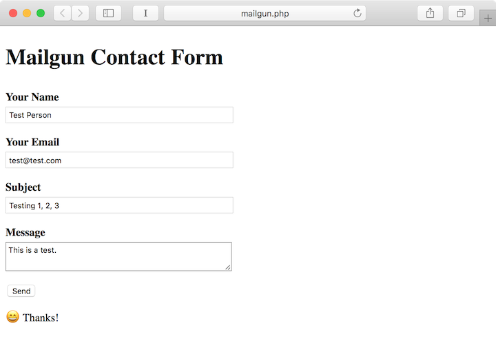
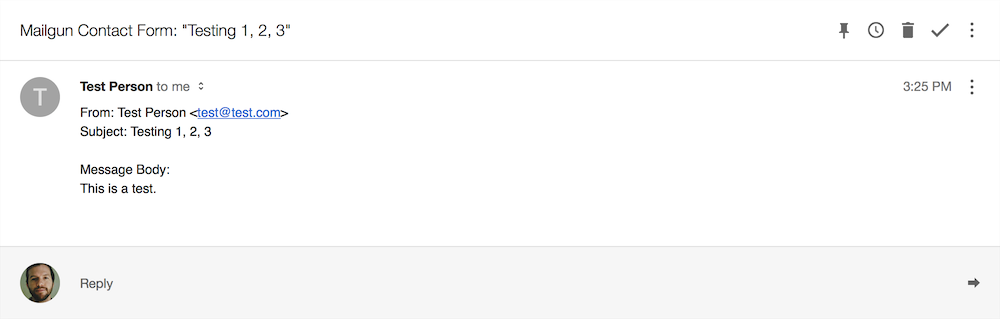
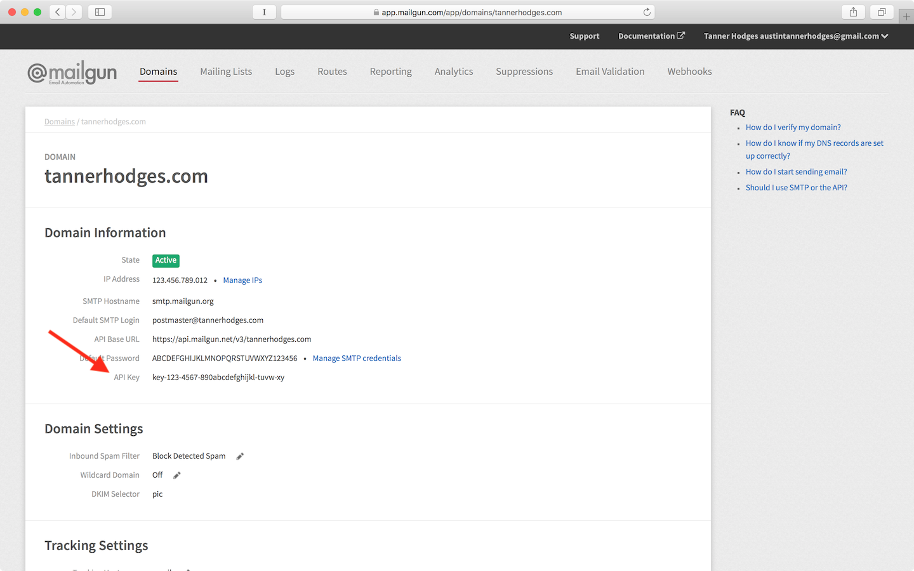

# Mailgun Contact Form

Basic example using Mailgun and PHP to submit a contact form.

## Install

1. Rename `.env.example` to `.env` and add your personal settings.
2. Start a PHP server and set `public/` as your root directory.
3. Load the page, submit the form, and check your email.

## Screenshots

Form:

Email:

## Notes

To keep your API keys secret:

- Make the Mailgun request server-side (e.g., with a PHP script)
- Add your keys to a `.env` file
- Add `.env` to your `.gitignore`

To find your API key:

- Login to [Mailgun](https://app.mailgun.com/sessions/new)
- Add a new domain
- Copy your API key

